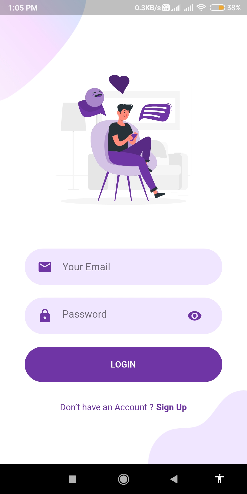
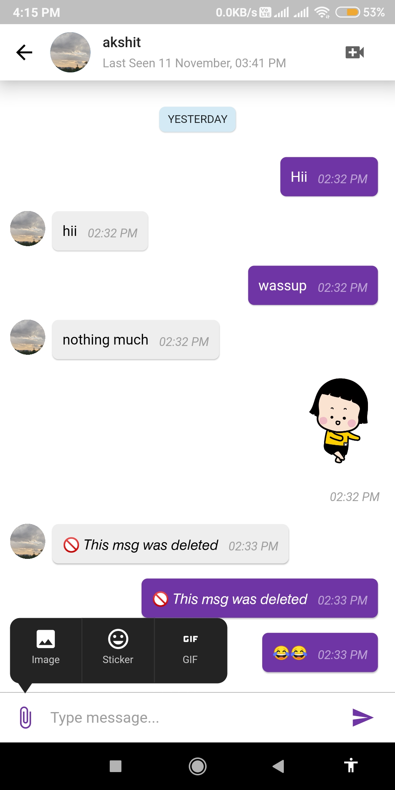

 

# Chatify

Social Networking mobile app similar to Instagram in React Native.

## Download Apk File from below

* <a href='https://drive.google.com/file/d/1joVvx4xqMh4QwJO0x4a4yDBKrdZwxqHU/view?usp=sharing'>app-arm64-v8a-release</a>
* <a href='https://drive.google.com/file/d/1t4xe6qeycCJXyYccBBhgXa9n27f34MtZ/view?usp=sharing'>app-armeabi-v7a-release</a>
* <a href='https://drive.google.com/file/d/1mZTFdGooTDk_9mKcN2cFDhBUtI6i0fDE/view?usp=sharing'>app-x86_64-release</a>

## Features

* User Authentication.
* Realtime chat.
* Send text messages, stickers, GIFs & Images.
* Permanently delete messages.
* View recent chats.
* View user status online / offline / Lastseen.
* Notifications on new message.
* Video calling.
* View / delete the call logs.

## Demo

<h4 align="center">Chatting Page</h4>

 

<h4 align="center">Video Calling</h4>

<h4 align="center">Welcome Screen &nbsp&nbsp&nbsp&nbsp | &nbsp&nbsp&nbsp&nbsp Login Screen &nbsp&nbsp&nbsp&nbsp | &nbsp&nbsp&nbsp&nbsp Signup Screen</h4>

<h4 align="center">Recent Chats Screen &nbsp&nbsp&nbsp&nbsp | &nbsp&nbsp&nbsp&nbsp Users List Screen &nbsp&nbsp&nbsp&nbsp | &nbsp&nbsp&nbsp&nbsp Call Logs Screen</h4>

<h4 align="center">User Profile Screen &nbsp&nbsp&nbsp&nbsp | &nbsp&nbsp&nbsp&nbsp Pickup Screen &nbsp&nbsp&nbsp&nbsp</h4>

<!--  -->

